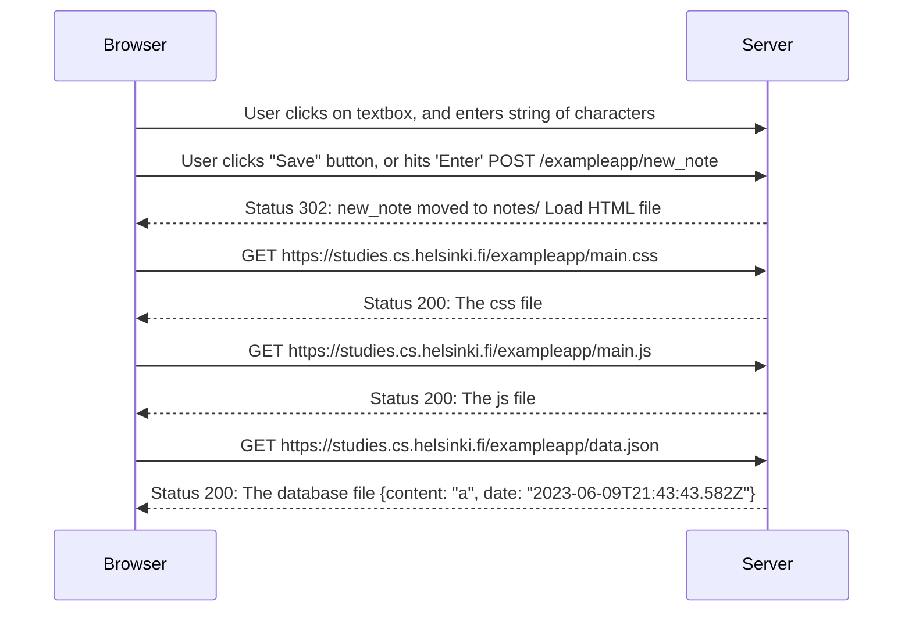

```mermaid
sequenceDiagram
Browser->>Server: User clicks on textbox, and enters string of characters
Browser->>Server: User clicks "Save" button, or hits 'Enter'  POST /exampleapp/new_note
Server-->>Browser:  Status 302: new_note moved to notes/ Load HTML file
Browser->>Server: GET https://studies.cs.helsinki.fi/exampleapp/main.css
Server-->>Browser:  Status 200: The css file
Browser->>Server: GET https://studies.cs.helsinki.fi/exampleapp/main.js
Server-->>Browser:  Status 200: The js file
Browser->>Server: GET https://studies.cs.helsinki.fi/exampleapp/data.json
Server-->>Browser:  Status 200: The database file {content: "a", date: "2023-06-09T21:43:43.582Z"}
```