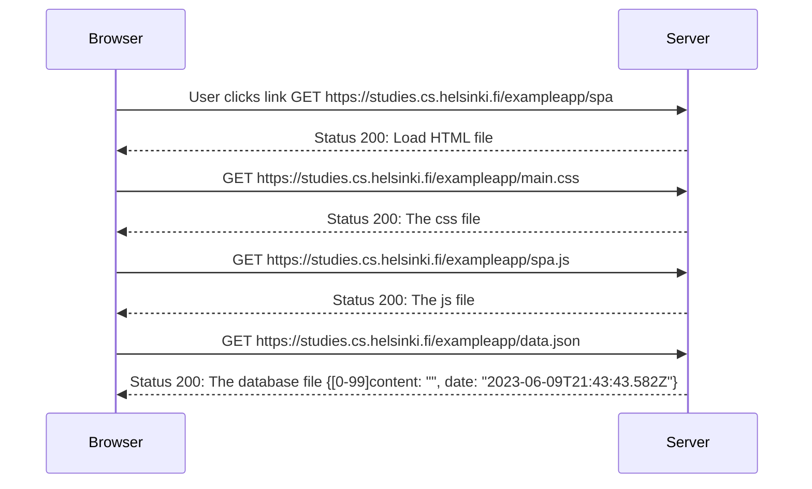

```mermaid
sequenceDiagram
Browser->>Server: User clicks link  GET https://studies.cs.helsinki.fi/exampleapp/spa
Server-->>Browser:  Status 200: Load HTML file
Browser->>Server: GET https://studies.cs.helsinki.fi/exampleapp/main.css
Server-->>Browser:  Status 200: The css file
Browser->>Server: GET https://studies.cs.helsinki.fi/exampleapp/spa.js
Server-->>Browser:  Status 200: The js file
Browser->>Server: GET https://studies.cs.helsinki.fi/exampleapp/data.json
Server-->>Browser:  Status 200: The database file {[0-99]content: "", date: "2023-06-09T21:43:43.582Z"}
```