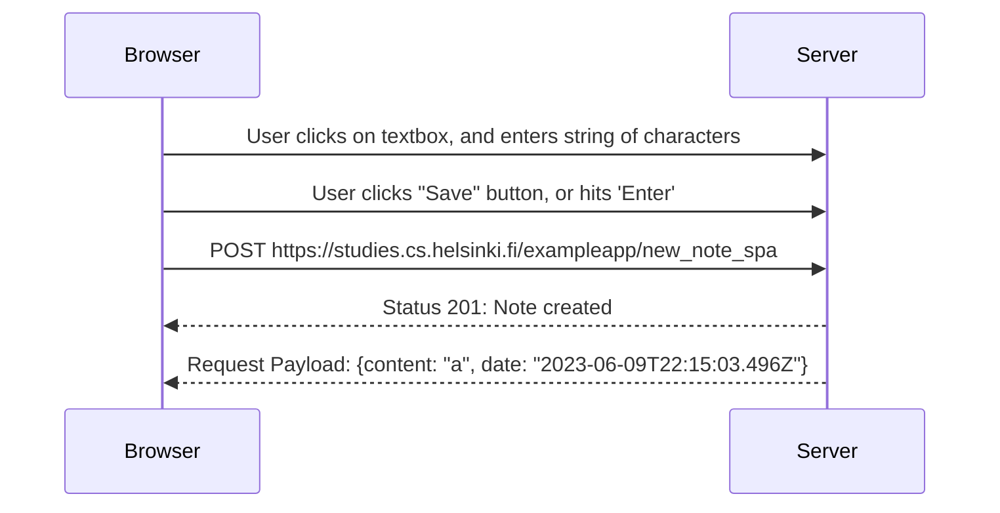

```mermaid
sequenceDiagram
Browser->>Server: User clicks on textbox, and enters string of characters
Browser->>Server: User clicks "Save" button, or hits 'Enter'  
Browser->>Server: POST https://studies.cs.helsinki.fi/exampleapp/new_note_spa
Server-->>Browser:  Status 201: Note created
Server-->>Browser:  Request Payload: {content: "a", date: "2023-06-09T22:15:03.496Z"}
```